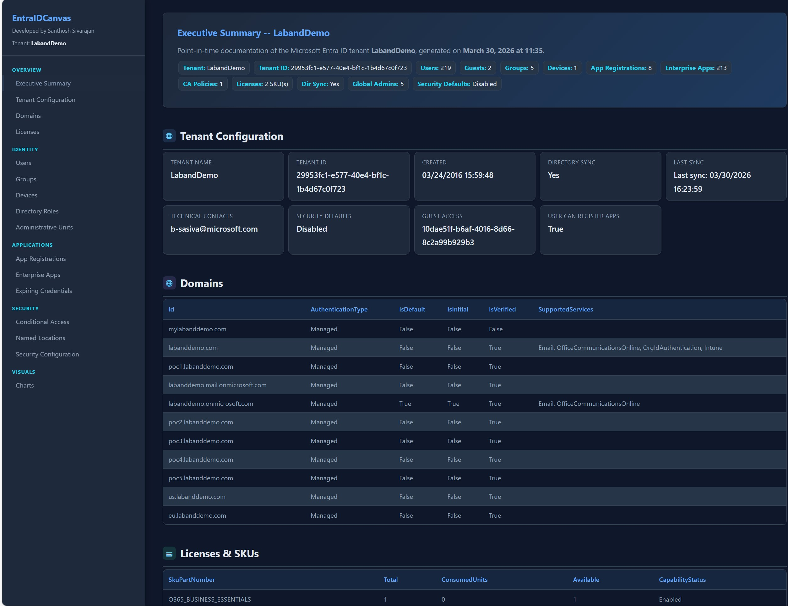

# EntraIDCanvas

### Paint the Full Picture of Your Entra ID Tenant

**Author:** Santhosh Sivarajan, Microsoft MVP
**GitHub:** [https://github.com/SanthoshSivarajan/EntraIDCanvas](https://github.com/SanthoshSivarajan/EntraIDCanvas)

---

## Overview

EntraIDCanvas is a single PowerShell script that queries your Microsoft Entra ID (Azure AD) tenant via Microsoft Graph and generates a **self-contained HTML report**. No external dependencies, no agents, no internet required after data collection.

Run one script. Open one HTML file. See everything.

## Quick Start

```powershell
# Install Microsoft Graph module (one time)
Install-Module Microsoft.Graph -Scope CurrentUser

# Run the script
.\EntraIDCanvas.ps1
```

The script will prompt for authentication and consent. Open the generated `EntraIDCanvas_<timestamp>.html` in any browser.

## What EntraIDCanvas Collects

### Tenant & Organization

| Category | Details |
|---|---|
| **Tenant Configuration** | Name, ID, creation date, technical contacts, directory sync status, last sync time |
| **Domains** | All verified domains with authentication type, default/initial status, supported services |
| **Licenses & SKUs** | All subscribed SKUs with total, consumed, and available counts |
| **Security Defaults** | Enabled or disabled status |
| **Authorization Policy** | Guest access settings, user app registration permissions |

### Identity

| Category | Details |
|---|---|
| **Users** | Total, enabled, disabled, members, guests, synced, cloud-only, licensed, unlicensed, inactive 90d+, never signed in |
| **Groups** | Total, security, Microsoft 365, distribution, dynamic, assigned, synced, cloud-only |
| **Devices** | Total, Entra joined, hybrid joined, registered, compliant, managed, OS distribution |
| **Directory Roles** | All active roles with member count and member names |
| **Administrative Units** | All AUs with membership type |

### Applications

| Category | Details |
|---|---|
| **App Registrations** | All registrations with sign-in audience, creation date (top 50 shown) |
| **Enterprise Apps** | Total service principals by type (Application, Managed Identity) |
| **Expiring Credentials** | App secrets and certificates expiring within 30 days or already expired |

### Security

| Category | Details |
|---|---|
| **Conditional Access** | All policies with state (enabled/disabled/report-only), conditions, grant controls |
| **Named Locations** | All named locations with type |
| **Security Configuration** | Consolidated view of security defaults, global admin count, CA policy count, guest users, app registration permissions, device compliance ratio, expiring credentials |

### Visual Components (12 Charts)

- User Status (donut) -- enabled/disabled/members/guests
- User Source (donut) -- cloud-only vs synced
- User Licensing (donut) -- licensed vs unlicensed
- Group Types (donut) -- security/M365/distribution
- Group Membership Type (donut) -- dynamic vs assigned
- Group Source (donut) -- cloud vs synced
- Device Join Type (donut) -- Entra joined/hybrid/registered
- Device Compliance (donut) -- compliant vs non-compliant
- Device OS Distribution (donut)
- CA Policy Status (donut) -- enabled/disabled/report-only
- Service Principal Types (donut) -- application/managed identity
- Directory Roles (bar) -- top 10 by member count

## Requirements

- Windows PowerShell 5.1+ or PowerShell 7+
- **Microsoft.Graph PowerShell module** -- `Install-Module Microsoft.Graph -Scope CurrentUser`
- An Entra ID account with read permissions (Global Reader role recommended)
- Internet access during data collection (to reach Microsoft Graph API)

### Required Graph Permissions

The script requests these scopes during authentication:

```
Directory.Read.All, User.Read.All, Group.Read.All, Application.Read.All,
Policy.Read.All, RoleManagement.Read.Directory, Device.Read.All,
Organization.Read.All, AuditLog.Read.All, Domain.Read.All,
Policy.Read.ConditionalAccess, UserAuthenticationMethod.Read.All
```

All are **read-only** permissions. The script does not modify anything in your tenant.

## Usage

```powershell
# Basic usage (saves to script directory)
.\EntraIDCanvas.ps1

# Specify output path
.\EntraIDCanvas.ps1 -OutputPath C:\Reports
```

Output:
```
EntraIDCanvas_2026-03-30_143022.html
```

## Error Handling

EntraIDCanvas is designed to be resilient:

- Each data collection call is wrapped in error handling
- If specific permissions are missing, those sections show as empty
- The report always generates even with partial data
- Console output clearly shows which components were collected or skipped

## Report Features

- **Dark navy/slate theme** with sidebar navigation
- **12 interactive charts** (donut and bar)
- **Responsive design** -- works on desktop, tablet, and mobile
- **Print-friendly** -- automatic light theme when printing
- **Zero external dependencies** -- all CSS, JS, and SVG are inline
- **Self-contained HTML** -- no web server needed


### Executive Summary


### Section


### Charts


### Summary


## Screenshots

### Executive Summary


### Per-Domain Section


### Forest-Wide Charts


### DC Table


## License

MIT -- Free to use, modify, and distribute.

## Contributing

Pull requests welcome. Please open an issue first to discuss major changes.

## Related Projects

- [ADCanvas](https://github.com/SanthoshSivarajan/ADCanvas) -- Active Directory documentation tool (on-premises AD)

---

*Developed by Santhosh Sivarajan, Microsoft MVP*

